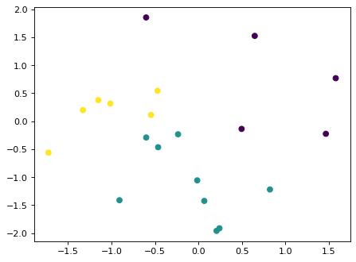
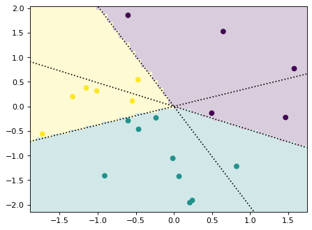

# Decision region plotting tools


```python
!pip install -e .
```

    Defaulting to user installation because normal site-packages is not writeable
    Obtaining file:///home/yutongw/projects/drplot
      Preparing metadata (setup.py) ... [?25ldone
    [?25hRequirement already satisfied: matplotlib in /sw/pkgs/arc/python3.10-anaconda/2023.03/lib/python3.10/site-packages (from drplot==0.1.0) (3.7.0)
    Requirement already satisfied: numpy in /sw/pkgs/arc/python3.10-anaconda/2023.03/lib/python3.10/site-packages (from drplot==0.1.0) (1.23.5)
    Requirement already satisfied: contourpy>=1.0.1 in /sw/pkgs/arc/python3.10-anaconda/2023.03/lib/python3.10/site-packages (from matplotlib->drplot==0.1.0) (1.0.5)
    Requirement already satisfied: cycler>=0.10 in /sw/pkgs/arc/python3.10-anaconda/2023.03/lib/python3.10/site-packages (from matplotlib->drplot==0.1.0) (0.11.0)
    Requirement already satisfied: fonttools>=4.22.0 in /sw/pkgs/arc/python3.10-anaconda/2023.03/lib/python3.10/site-packages (from matplotlib->drplot==0.1.0) (4.25.0)
    Requirement already satisfied: kiwisolver>=1.0.1 in /sw/pkgs/arc/python3.10-anaconda/2023.03/lib/python3.10/site-packages (from matplotlib->drplot==0.1.0) (1.4.4)
    Requirement already satisfied: packaging>=20.0 in /sw/pkgs/arc/python3.10-anaconda/2023.03/lib/python3.10/site-packages (from matplotlib->drplot==0.1.0) (22.0)
    Requirement already satisfied: pillow>=6.2.0 in /sw/pkgs/arc/python3.10-anaconda/2023.03/lib/python3.10/site-packages (from matplotlib->drplot==0.1.0) (9.4.0)
    Requirement already satisfied: pyparsing>=2.3.1 in /sw/pkgs/arc/python3.10-anaconda/2023.03/lib/python3.10/site-packages (from matplotlib->drplot==0.1.0) (3.0.9)
    Requirement already satisfied: python-dateutil>=2.7 in /sw/pkgs/arc/python3.10-anaconda/2023.03/lib/python3.10/site-packages (from matplotlib->drplot==0.1.0) (2.8.2)
    Requirement already satisfied: six>=1.5 in /sw/pkgs/arc/python3.10-anaconda/2023.03/lib/python3.10/site-packages (from python-dateutil>=2.7->matplotlib->drplot==0.1.0) (1.16.0)
    Installing collected packages: drplot
      Attempting uninstall: drplot
        Found existing installation: drplot 0.1.0
        Uninstalling drplot-0.1.0:
          Successfully uninstalled drplot-0.1.0
      Running setup.py develop for drplot
    Successfully installed drplot


```python
import numpy as np
import matplotlib.pyplot as plt
import drplot.plot as drplt

plt.style.use('default')
plt.rcParams['figure.dpi'] = 80

def make_dataset(num_samples, num_classes, num_features, random_seed = None):
    if random_seed is not None:
        np.random.seed(random_seed)
    X = np.random.randn(num_samples,num_features)
    Wstar = np.random.randn(num_features,num_classes)      # ground truth classifier
    y = np.argmax(X@Wstar,axis=1)     # labels
    return X, y, Wstar

num_samples = 20
num_classes = 3
num_features = 2
X,y,Wstar = make_dataset(num_samples,num_classes,num_features,42)
plt.scatter(X[:,0],X[:,1],c = y)
```


    <matplotlib.collections.PathCollection at 0x1529aa00fb50>


    

    


```python
plt.scatter(X[:,0],X[:,1],c = y)
drplt.dec_bdry_lin_3c_2d(Wstar)
drplt.plot_dec_regi(Wstar)
```


    

    

