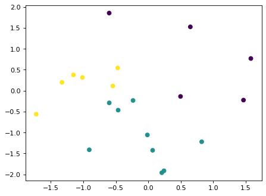
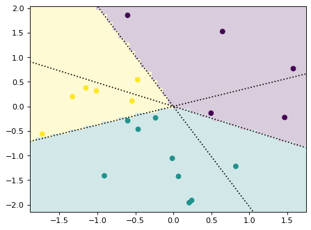

# Decision region plotting tools

For plotting decision regions of classifiers. See example below.

## Installation

Navigate to the root directory of this package and run.


```python
%%capture
!pip install -e .
```

## Usage example

Generate an example dataset:


```python
import numpy as np
import matplotlib.pyplot as plt
import drplot.plot as drplt

plt.style.use('default')
plt.rcParams['figure.dpi'] = 80

def make_dataset(num_samples, num_classes, num_features, random_seed = None):
    if random_seed is not None:
        np.random.seed(random_seed)
    X = np.random.randn(num_samples,num_features)
    Wstar = np.random.randn(num_features,num_classes)      # ground truth classifier
    y = np.argmax(X@Wstar,axis=1)     # labels
    return X, y, Wstar

num_samples = 20
num_classes = 3
num_features = 2
X,y,Wstar = make_dataset(num_samples,num_classes,num_features,42)
plt.scatter(X[:,0],X[:,1],c = y)
```


    <matplotlib.collections.PathCollection at 0x1529a9d16ec0>


    

    


## Plot the decision regions


```python
plt.scatter(X[:,0],X[:,1],c = y)
drplt.dec_bdry_lin_3c_2d(Wstar)
drplt.plot_dec_regi(Wstar)
```


    

    


```python

```
